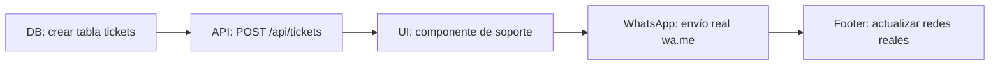
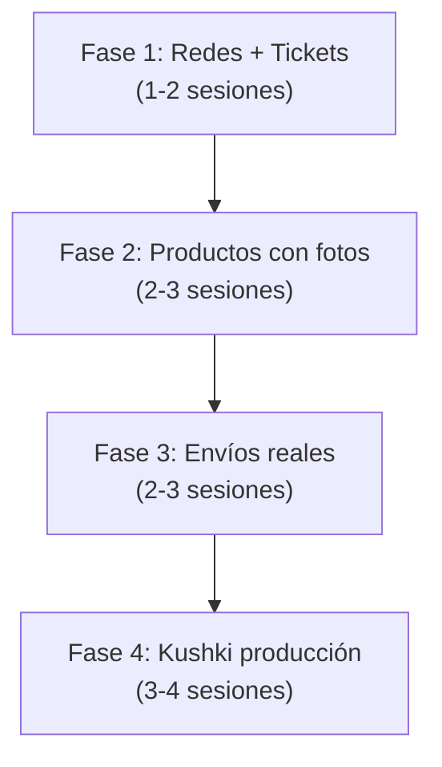

# Plan de Pendientes — Munay

> **Última actualización:** 30/7/2026  
> **Rama actual:** `v0/munay-expansion-clean` (desplegada en producción)  
> **Estado:** 4 pendientes identificados

---

## Resumen

| # | Pendiente | Prioridad | Esfuerzo | Dependencias |
|:---:|---|:---:|:---:|:---:|
| 1 | Sistema de tickets + WhatsApp | 🔴 Alta | Medio | — |
| 2 | Envío: gratis Ibarra / Servientrega | 🔴 Alta | Alto | Migración DB |
| 3 | Productos con fotos | 🔴 Alta | Medio | Storage + subida |
| 4 | Kushki (pagos reales) | 🟡 Media | Alto | Kushki.js SDK |

---

## 1. Sistema de tickets + WhatsApp

**Estado actual:** ❌ No existe. El footer tiene iconos de Facebook/Twitter/Instagram (lucide-react) con `href="#"` — sin enlaces reales. `SITE.whatsapp` tiene un placeholder `+593 99 000 0000`.

### Tareas



| # | Tarea | Archivos |
|:---:|---|:---:|
| 1.1 | **Migración SQL** — crear tabla `tickets` (id, name, email, message, status, created_at) | `scripts/` + Neon SQL Editor |
| 1.2 | **API route** — `POST /api/tickets` que inserta en DB y devuelve confirmación | `src/app/api/tickets/route.ts` |
| 1.3 | **Componente UI** — formulario de soporte en `/cuenta/soporte` y/o modal flotante en toda la web | `src/components/support/` |
| 1.4 | **Envío WhatsApp** — al crear un ticket, enviar notificación al número Munay vía `wa.me/+593959756845` (abrir enlace o integrar WhatsApp Business API) | `src/lib/whatsapp.ts` |
| 1.5 | **Footer: redes reales** — reemplazar Facebook/Twitter por WhatsApp/Instagram/TikTok con URLs reales y SVGs inline | `src/components/munay/footer.tsx` |
| 1.6 | **Constants** — actualizar `SITE.whatsapp` con número real `+593959756845` | `src/lib/constants.ts` |

---

## 2. Envío: gratis Ibarra / Servientrega nacional

**Estado actual:** ❌ Shipping es un mock de $2.00 fijos (`const shipping = adjustedTotalCents > 0 ? 200 : 0`). El usuario ingresa ciudad/provincia en checkout pero no afecta el cálculo.

### Tareas

| # | Tarea | Archivos |
|:---:|---|:---:|
| 2.1 | **Migración SQL** — crear tabla `shipping_zones` con ciudades/provincias y tarifas | `scripts/` + Neon SQL Editor |
| 2.2 | **API route** — `POST /api/shipping/calculate` que recibe ciudad/provincia y devuelve costo | `src/app/api/shipping/calculate/route.ts` |
| 2.3 | **Checkout: shipping dinámico** — al cambiar ciudad, calcular costo real (0 si Ibarra, $X si otra) | `src/app/checkout/page.tsx` |
| 2.4 | **Carrito: shipping estimado** — mostrar costo estimado antes del checkout | `src/app/carrito/page.tsx` |
| 2.5 | **Info: página de envíos** — detalle de tarifas y tiempos de entrega | `src/app/info/page.tsx` (ya existe, agregar sección) |

### Tarifas sugeridas

| Ciudad/Provincia | Costo |
|:---|---:|
| Ibarra (urbano) | **Gratis** ($0.00) |
| Resto Imbabura | $2.00 |
| Quito / Pichincha | $3.50 |
| Costa (Guayaquil, Manta, etc.) | $5.00 |
| Oriente / Amazonía | $6.00 |
| Otras provincias | $4.00 |

---

## 3. Productos con fotos

**Estado actual:** ❌ `STORAGE_BUCKETS.productImages` existe en config pero no hay imágenes subidas. Los productos en DB tienen `image_url = null`.

### Tareas

| # | Tarea | Archivos |
|:---:|---|:---:|
| 3.1 | **Elegir storage** — Neon Storage, Cloudinary, o imágenes en `/public/products/` | Config |
| 3.2 | **Subir imágenes** — script bulk upload + asociar a productos existentes por slug | `scripts/upload-products-images.mjs` |
| 3.3 | **Panel admin: upload UI** — agregar campo de subida de imágenes en formulario de producto | `src/components/admin/product-form.tsx` |
| 3.4 | **Optimización** — Next/Image con remotePatterns configurado, webp conversion | `next.config.ts` |

### Opciones de storage

| Opción | Pros | Contras |
|:---|---:|:---:|
| **Cloudinary** | SDK fácil, transforms on-fly, CDN global | Plan free limitado (25GB) |
| **Neon Storage** | Mismo provider, sin latencia extra | Sin transforms, sin CDN |
| **`/public/products/`** | Gratis, sin dependencias | Sin CDN, sin transforms, + peso build |

---

## 4. Kushki (pagos reales)

**Estado actual:** 🟡 `NEXT_PUBLIC_KUSHKI_PUBLIC_KEY` configurada en `.env.local`. Checkout detecta automáticamente modo demo/producción. Pero el formulario usa inputs de tarjeta hardcodeados (4111...) en lugar de Kushki.js tokenization.

### Tareas

| # | Tarea | Archivos |
|:---:|---|:---:|
| 4.1 | **Kushki.js SDK** — instalar y cargar el script de Kushki en checkout | `package.json` + `src/app/checkout/page.tsx` |
| 4.2 | **Tokenización** — reemplazar inputs de tarjeta por Kushki.js embebido (no toca nuestro servidor) | `src/components/checkout/kushki-card-form.tsx` |
| 4.3 | **API payments/create** — verificar que acepte `card_token` real de Kushki (ya tiene soporte) | `src/app/api/payments/create/route.ts` |
| 4.4 | **Webhook** — verificar endpoint `/api/payments/webhook` para confirmación asíncrona | `src/app/api/payments/webhook/route.ts` |

### Flujo post-implementación

```
Usuario llena formulario Kushki.js embebido
        ↓
Kushki.js devuelve card_token (nunca vemos la tarjeta)
        ↓
POST /api/payments/create { order_id, card_token }
        ↓
Backend: Kushki API charge() con token
        ↓
Redirect a /checkout/success?order=xxx
```

---

## Priorización recomendada



### Por qué este orden

1. **Redes + Tickets** — impacto inmediato en conversión (clientes pueden contactar) y effort bajo
2. **Fotos** — el catálogo sin fotos no vende. Prioridad alta
3. **Envíos** — desbloquea ventas fuera de Ibarra. Depende de tener fotos primero
4. **Kushki** — el más complejo, requiere pruebas. El modo demo ya permite probar el flujo completo

---

## Rollback

Cada fase debe hacerse en una rama separada desde `v0/munay-expansion-clean`:
```bash
git checkout v0/munay-expansion-clean
git checkout -b feat/tickets-whatsapp
# ... implementar ...
git tag v0.3-tickets
```

Si algo falla en producción:
```bash
git checkout v0/munay-expansion-clean
npx vercel --prod --yes
```
